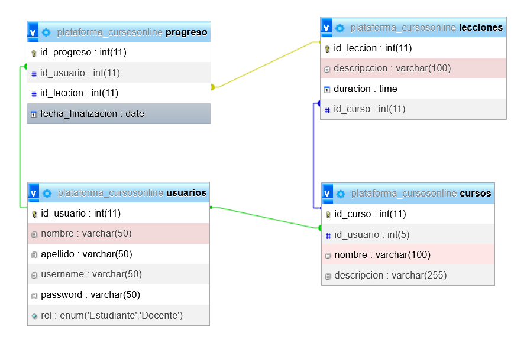

# GRAN MURALLA CHINA

# 

Este repositorio contiene una base de datos creada con MySQL para una pagina web de cursos online, donde puedan alojar informaciones sobre sus usuarios, cursos y lecciones.

## Lenguagen de programación y herramientas de gestión

- MySQL
- Buenas prácticas de SQL
- Trello
- Github

## Contenido
- Scripts para la construcción de la Base de Datos
- Script para insertar Datos en la Base de Datos
- Diagrama de Entidad de Relaciones
- Enlace al repositorio de github

## Modalidades pedagógicas trabajadas

- trabajo en equipo
- sprint
- SCRUM (Roles, Daily, Planning, Retrospective)
- Git para control de versiones

## links

- https://trello.com/b/Q57uAI80/cursos-online
- https://github.com/FF5-DW1/ej4_granMurallaChina

## PARTICIPANTES

Patricia, Gladys, Andres.

